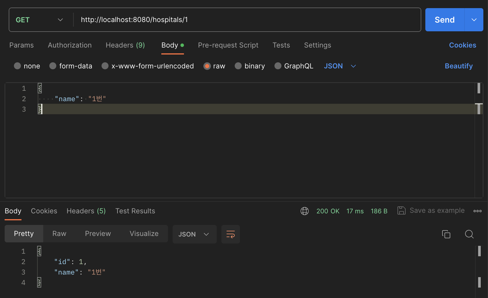
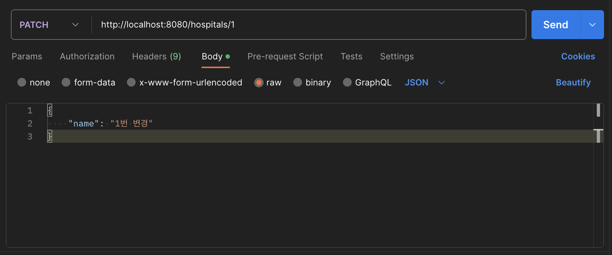
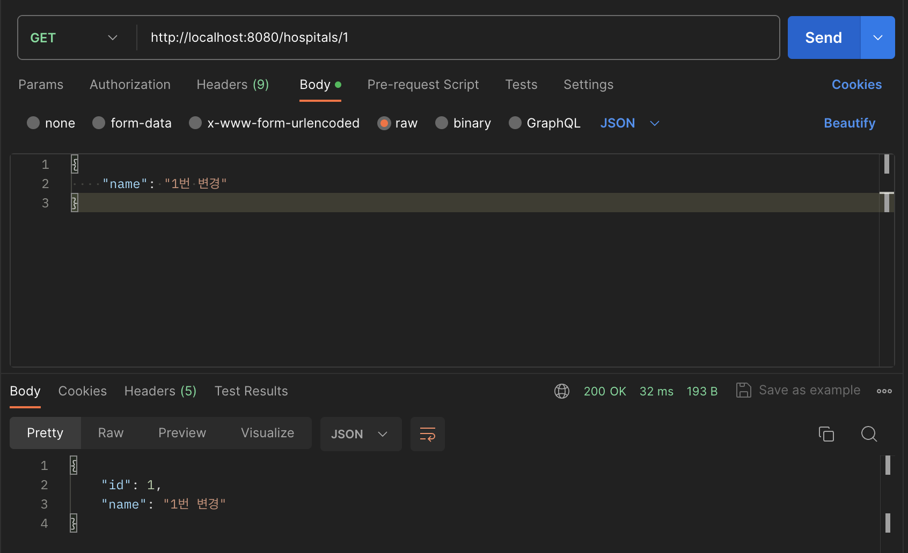
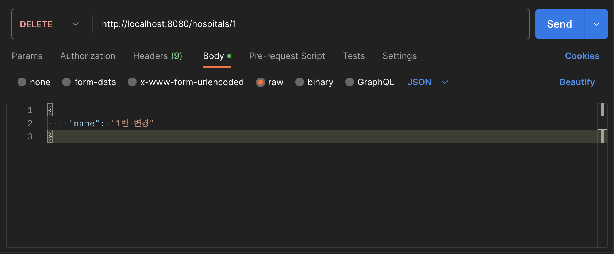
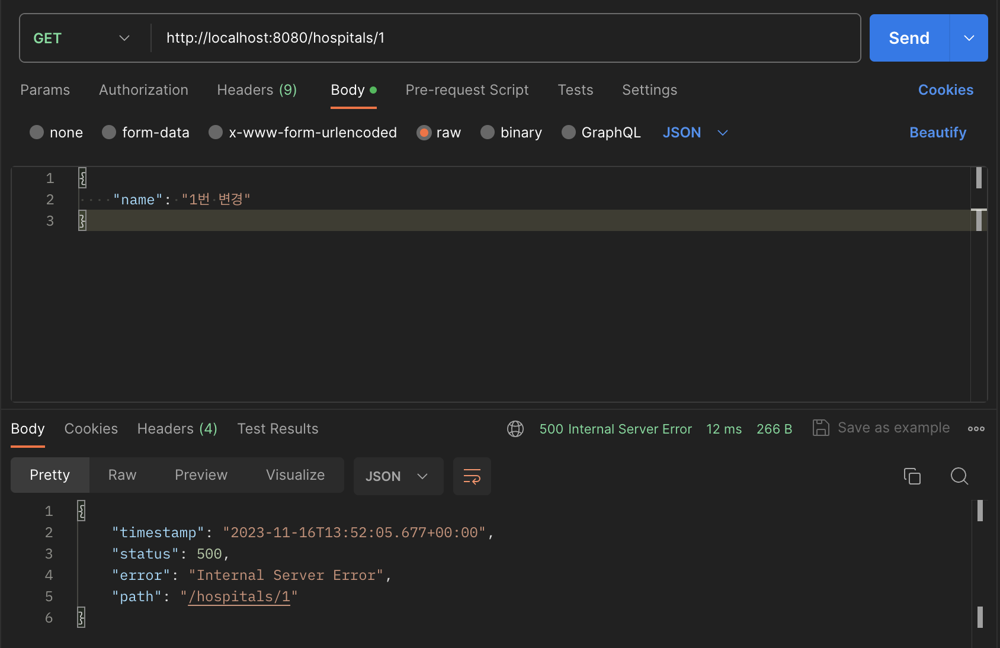

# \[1] 영속성 컨텍스트

## 1) 캐싱  <br>2) 동일성 보장

데이터베이스에 있는 객체에 대해 수정/삭제가 필요한 경우, 스프링 컨테이너는 그것을 직접적으로 수정/삭제하지 않고 영속성 컨텍스트 공간에 1차적으로 그 내용을 저장한다.
이때 영속성 컨텍스트와 데이터베이스 사이의 불일치가 발생하는데, 만약 수정/삭제된 객체에 대한 조회가 요구되면 데이터베이스가 아닌 영속성 컨텍스트를 먼저 조회함으로써 해당 객체의 내용을 반환하게 된다.
영속성 컨텍스트가 캐시의 역할을 하여 쿼리의 발생이 감소하는 동시에 동일성 문제까지 해결해주는 것이다.

## 3) 변경 감지 (Dirty Checking)  <br>4) 트랜잭션을 지원하는 쓰기 지연 (transactional write-behind)

1. 트랜잭션 시작 (영속성 엔티티들의 정보, 즉 스냅샷을 저장)
2. 영속성 엔티티 조회 (존재하지 않을 시 데이터베이스에서 조회 후 영속화)
3. 영속성 엔티티 수정
4. 트랜잭션 커밋

JPA는 트랜잭션을 종료해 commit()이 호출될 때, 스냅샷으로부터 변동사항이 있는 영속성 엔티티들을 찾아 데이터베이스를 수정 및 저장, 또는 삭제하는 쿼리를 자동적으로 생성해준다.
즉, 프로그래머는 영속성 엔티티를 수정/삭제하기만 하면 트랜잭션이 닫힐 때 JPA가 스스로 영속성 컨텍스트와 데이터베이스를 동기화해주는 것이다.

참고로 JPA는 트랜잭션이 시작하고 발생한 모든 쿼리들을 따로 모아두았다가 트랜잭션이 닫힐 때 해당 쿼리들을 데이터베이스에 전송하는데, 이를 쓰기 지연이라고 한다.

## 5) 지연 로딩 (Lazy Loading)

즉시 로딩(Eager Loading)과 지연 로딩(Lazy Loading)을 지원한다.
지연 로딩을 사용할 경우, 의존 관계에 있는 객체를 직접적으로 이용하는 시점에 쿼리를 전송하게 된다.

가령 `@ManyToOne(fetch = FetchType.LAZY)`으로 Hospital에 매핑되어 있는 MedicalDepartment를 조회할 때, Hospital을 조회하는 쿼리를 같이 전송하는 것이 아니라 Hospital의 프록시 객체를 받아두었다가 해당 Hospital 객체를 직접적으로 사용할 때 쿼리를 전송한다.
만약 즉시 로딩을 사용한다면 MedicalDepartment 조회 시에 MedicalDepartment 조회 쿼리와 Hospital 조회 쿼리가 모두 전송된다.
따라서 즉시 로딩에는 예상치 못 한 쿼리 발생으로 인해 N+1 문제의 우려가 있어 가급적 지연 로딩을 사용하는 것이 바람직하다.

아래는 각각 즉시 로딩과 지연 로딩을 사용했을 때 생성된 쿼리이다.
지연 로딩이 아닌 즉시 로딩을 사용해 MedicalDepartment를 조회하면 의존관계에 있는 Hospital을 조회하는 쿼리까지 발생함을 알 수 있다.

```
Hibernate: 
    select
        m1_0.id,
        m1_0.hospital_id,
        m1_0.name 
    from
        medical_department m1_0
Hibernate: 
    select
        h1_0.id,
        h1_0.name 
    from
        hospital h1_0 
    where
        h1_0.id=?
```

```
Hibernate: 
    select
        m1_0.id,
        m1_0.hospital_id,
        m1_0.name 
    from
        medical_department m1_0
```

<br>그런데 Service 계층에서 지연 로딩 전략으로 저장한 객체를 Controller 계층에서 사용하는 경우, 트랜잭션이 이미 닫혀 준영속 상태이기 때문에 정상적인 객체 조회가 불가능해진다.
따라서 영속성 엔티티를 DTO로 변환하여 사용하는 것이 바람직하고, 필요하다면 JPQL의 Fetch Join, 또는 BatchSize 등을 사용할 수도 있다.

***
# \[2] 📖 프로그램 구현 과제

## 1) Update/Delete Hospital











## 2) Update/Delete Reservation

### ReservationController.java

```java
@RestController
@RequestMapping("/reservations")
@RequiredArgsConstructor
public class ReservationController {
	private final ReservationService reservationService;
	
	@GetMapping()
	public List<Reservation> getAllReservations() {
		return reservationService.getAllReservations();
	}
	
	@PostMapping()
	public void createReservation(@RequestBody CreateReservationDto createReservationDto) {
		reservationService.createReservation(createReservationDto);
	}
	
	@PatchMapping("/{id}")
	public void updateReservation(@PathVariable("id") Long id, @RequestBody UpdateReservationDto updateReservationDto) {
		reservationService.updateReservation(id, updateReservationDto);
	}
	
	@DeleteMapping("/{id}")
	public void deleteReservation(@PathVariable("id") Long id) {
		reservationService.deleteReservation(id);
	}
}
```

### ReservationService.java

```java
@Service
@RequiredArgsConstructor
public class ReservationService {
	private final ReservationRepository reservationRepository;
	private final DoctorRepository doctorRepository;
	private final PatientRepository patientRepository;
	
	public List<Reservation> getAllReservations() {
		return reservationRepository.findAll();
	}
	
	public void createReservation(CreateReservationDto createReservationDto) {
		Doctor doctor = doctorRepository.findById(createReservationDto.getDoctorId())
				.orElseThrow(RuntimeException::new);
		Patient patient = patientRepository.findById(createReservationDto.getPatientId())
				.orElseThrow(RuntimeException::new);
		reservationRepository.save(new Reservation(doctor, patient, createReservationDto.getTime()));
	}
	
	@Transactional
	public void updateReservation(Long id, UpdateReservationDto updateReservationDto) {
		Reservation reservation = reservationRepository.findById(id).orElseThrow(RuntimeException::new);
		reservation.updateTime(updateReservationDto.getTime());
	}
	
	@Transactional
	public void deleteReservation(Long id) {
		reservationRepository.deleteById(id);
	}
}
```

### ReservationRepository.java

```java
@Repository
public interface ReservationRepository extends JpaRepository<Reservation, Long> {
}
```

### Reservation.java

```java
@Getter
@Entity
@NoArgsConstructor(access = AccessLevel.PROTECTED)
public class Reservation {
	@Id
	@GeneratedValue(strategy = GenerationType.IDENTITY)
	private long id;
	
	@ManyToOne(fetch = FetchType.LAZY)
	@JsonIgnore
	Doctor doctor;
	
	@ManyToOne(fetch = FetchType.LAZY)
	@JsonIgnore
	Patient patient;
	
	private String time;
	
	public Reservation(Doctor doctor, Patient patient, String time) {
		this.doctor = doctor;
		this.patient = patient;
		this.time = time;
	}
	
	public void updateTime(String time) {
		this.time = time;
	}
}
```

### CreateReservationDto.java

```java
@Getter
@AllArgsConstructor
@NoArgsConstructor
public class CreateReservationDto {
	private String time;
	private Long doctorId;
	private Long patientId;
}
```

### UpdateReservationDto.java

```java
@Getter
@AllArgsConstructor
@NoArgsConstructor
public class UpdateReservationDto {
	private String time;
}
```